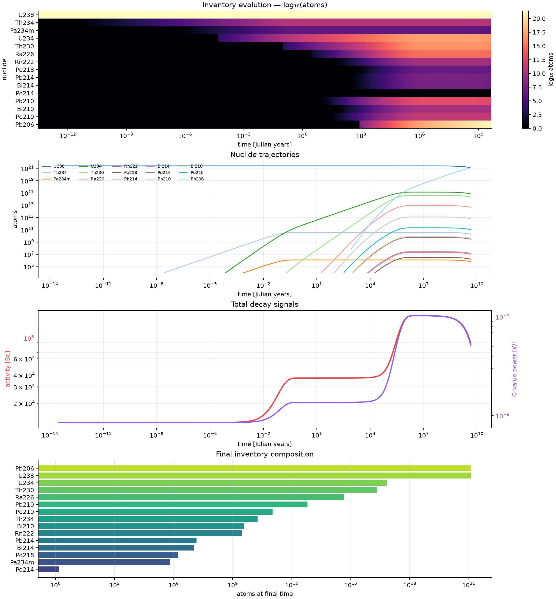

# Nuclide Atlas

**A unit-aware nuclear isotope database and decay-chain calculator built with [SciNumTools3](https://github.com/vrtulka23/scinumtools3).**

`nuclide-atlas` turns a tiny, validated DIPL scenario into a full nuclide inventory, activity history, CSV file, and publication-ready plot. It is deliberately useful as a small radiological-inventory tool, powered by SciNumTools3 for data, units, validation, and build configuration.

```dip
simulation
  sample
    isotope str = "U238"
    mass float = 1 g
  duration float = 4.5 Gyr
  points int = 1000
```

The application resolves the named nuclide from independent DIPL sources, converts its molar mass and sample mass through PUQ, then solves the linear decay system

```math
\frac{dN_i}{dt}=-\lambda_iN_i+\sum_j b_{ji}\lambda_jN_j.
```

## What is in the box

| Layer | What it demonstrates |
| --- | --- |
| DIPL database | One DIPL file per nuclide; source databases, hierarchical imports, typed fields, physical units, validation, and editable scenarios. |
| PUQ | `Gyr`, `MeV`, `Bq`, `ng`, `g/mol`, `min`, and `us` are parsed and dimensionally checked before numerical work starts. |
| C++20 | An exact Bateman-chain evaluator advances half-lives from microseconds to gigayears without an Euler timestep restriction. |
| Python | A small `matplotlib` script reads the portable CSV and plots atom inventories and total activity. |
| CMake | `cmake/build.dip` controls the C++ standard and plot target via SNT's `snt_dip_get()` helper at configure time. |

The seed database contains the U-238 series to stable Pb-206 and a short Pu-239 demonstration path. It is intentionally compact enough to audit, but its layout scales to a larger knowledge base:

```text
data/
  constants.dip
  elements/
  isotopes/
scenarios/
src/
python/
cmake/
```

## Why SciNumTools3 is useful here

YAML could store the same numbers, but it would leave Nuclide Atlas to build its own parser, unit converter, schema validator, reference resolver, provenance convention, and CMake bridge. SciNumTools3 gives this project those scientific semantics in one shared layer:

- `4.5 Gyr`, `100 ng`, `g/mol`, `MeV`, and `Bq` are physical quantities, not strings that the solver must interpret ad hoc.
- `data/nuclear.dip` owns `isotope_record` and `nuclear_simulation` schemas. The former validates every resolved isotope used by the solver (IDs, positive molar masses, non-negative half-lives and decay energies, branching fractions, and supported modes); the latter rejects invalid scenario values before C++ runs.
- Each isotope lives in an independently reviewable DIPL source and is imported into a coherent database; adding data does not require changing the solver.
- The same resolved data model is consumable from C++, Python, the SNT CLI, and CMake. `cmake/build.dip`, for example, controls build policy through `snt_dip_get()`.
- Citation metadata is attached to values with DIPL `?doi`, `?authors`, and related properties rather than being an unstructured comment beside a number.

That matters once this grows beyond a toy chain: the solver remains small because data integrity, units, validation, and provenance are handled consistently upstream of it.

## Quick start

SciNumTools3 must be installed with its CMake package files and the `snt` CLI. The project is tested against current SNT master commit [`9d60fc0`](https://github.com/vrtulka23/scinumtools3/commit/9d60fc0bd6c1f59d473eff6aeacc2fdae5d79dbc). A source installation is the most direct route:

```bash
git clone https://github.com/vrtulka23/scinumtools3.git
cmake -S scinumtools3 -B scinumtools3/build -G Ninja -DCMAKE_BUILD_TYPE=Release \
  -DCMAKE_INSTALL_PREFIX="$HOME/.local" -DENABLE_UNIT_TESTS=OFF \
  -DENABLE_BINDING_PYTHON=OFF -DENABLE_BINDING_C=OFF -DENABLE_EXEC_EXAMPLES=OFF
cmake --build scinumtools3/build
cmake --install scinumtools3/build

cmake -S . -B build -G Ninja -DCMAKE_PREFIX_PATH="$HOME/.local"
cmake --build build
```

### Fast development loop

For the usual configure/build/test/run loop, use the included helper instead of repeating the CMake commands:

```bash
chmod +x dev.sh
./dev.sh -bctr
```

`-b` configures, `-c` compiles, `-t` tests, `-r` runs, `-p` plots, and `--clean` removes only `build/`. Run `./dev.sh --help` for all options.

Run the default U-238 age calculation:

```bash
./build/nuclide-atlas --output build/inventory.csv
python3 -m pip install -r requirements.txt
cmake --build build --target plot
```

That writes `build/inventory.csv` and `build/inventory.png`. To make the same run without CMake’s plot target:

```bash
python3 python/plot_inventory.py build/inventory.csv build/inventory.png
```

### Example output

The default one-gram U-238 scenario spans microsecond daughters through 4.5 billion years, showing both nuclide inventory and total activity on a logarithmic time axis.



Query rather than simulate:

```bash
./build/nuclide-atlas --list
./build/nuclide-atlas --isotope U238
./build/nuclide-atlas --scenario scenarios/pu239_heat.dip --output build/pu239.csv
```

## Scenarios and data

A scenario states the sample, duration, output density, time grid, and output file. The shipped scenarios use a logarithmic reporting grid (plus `t=0`) so a single graph can show microsecond daughters and gigayear parents. Units are part of the data, never implied by a comment. Invalid mass, duration, point count, or grid settings are rejected by DIPL before the C++ solver runs.

The database root, `data/nuclear.dip`, uses `$source` directives and imports each independently maintained isotope as an item in the schema-backed `nuclear.isotopes[<id>]` map. The C++ program follows the selected daughter path dynamically, so adding an isotope is data work:

1. Create `data/isotopes/X.dip` from a nearby record.
2. Add the source and import in `data/nuclear.dip`.
3. Point a scenario at `X`.
4. Run `nuclide-atlas --isotope X` to inspect the resolved data.

Each record carries atomic mass, stability, half-life, daughter, branch fraction, decay mode, and decay energy. `data/constants.dip` and `data/elements/` show how the same format can grow into a broader scientific knowledge base.

## CSV contract

The solver emits one row per requested time point. Core columns are:

```text
time_s,time_yr,total_activity_bq,<isotope>_atoms,<isotope>_activity_bq,...
```

This keeps the numerical program dependency-light and makes output easy to use from pandas, R, Julia, spreadsheets, or a laboratory pipeline.

## Numerical method

The rate matrix is assembled directly from data:

```text
A[i,i]             = -lambda_i
A[daughter(i), i] += branching_i * lambda_i
N(t)               = exp(A t) N(0)
```

For the current serial-chain schema, the implementation evaluates the exact Bateman form: each inventory is represented as a weighted sum of `exp(-lambda*t)` terms. This is a much better fit than explicit stepping for chains whose half-lives range from microseconds to billions of years. It also means `points` controls reporting resolution, not solver stability.

## Scientific scope and data policy

This repository is useful for educational work, software prototyping, inventory visualisation, and transparent, unit-checked workflows. It is **not** a safety-analysis, dosimetry, shielding, criticality, licensing, or medical-decision tool.

The bundled values are a compact seed dataset, rounded for readable source control and selected to demonstrate the U-238 series. Before scientific publication or operational use, replace or independently validate records against an evaluated library such as [IAEA LiveChart](https://www-nds.iaea.org/relnsd/vcharthtml/VChartHTML.html), [NNDC NuDat](https://www.nndc.bnl.gov/nudat3/), or [AME/NUBASE](https://www-nds.iaea.org/amdc/). In particular:

- A record currently supports one explicit daughter branch. Rare side branches and the intermediate members compressed in the Pu-239 demonstration path are not a substitute for an evaluated full chain.
- Decay heat is not calculated from the listed Q values; the output activity is in Bq.
- No uncertainty propagation, spontaneous fission, neutron activation, transport, chemical separation, or external source term is modelled yet.

These boundaries are intentionally prominent: a transparent calculator should make it easy to see what its data and model do—and do not—claim.

## Contributing

See [CONTRIBUTING.md](CONTRIBUTING.md) for data-review rules, development commands, and expectations for new isotope records. See [docs/architecture.md](docs/architecture.md) for an implementation map and [docs/data-model.md](docs/data-model.md) for the data contract.

## License

MIT. See [LICENSE](LICENSE).
