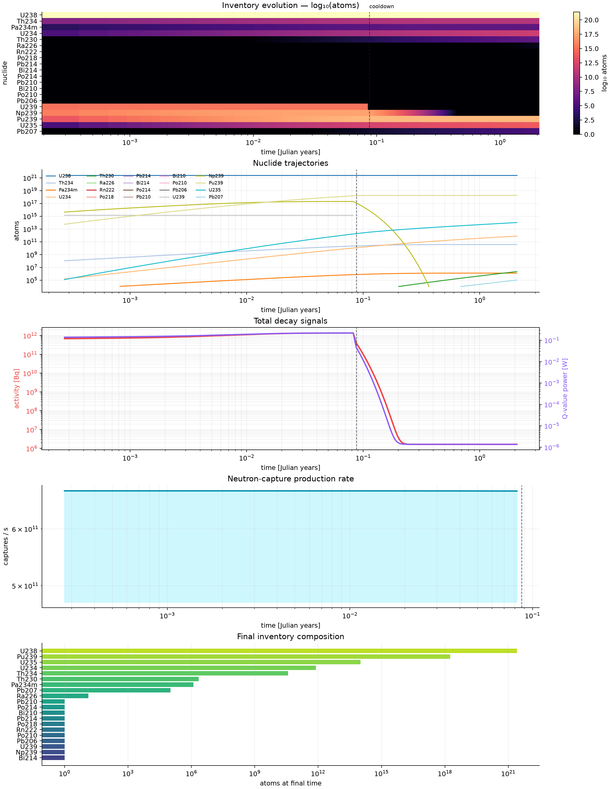

# Nuclide Atlas

**A unit-aware nuclear isotope database and decay-chain calculator built with [SciNumTools3](https://github.com/vrtulka23/scinumtools3).**

`nuclide-atlas` turns a tiny, validated DIPL scenario into a full nuclide inventory, activity history, CSV file, and publication-ready plot. It is deliberately useful as a small radiological-inventory tool, powered by SciNumTools3 for data, units, validation, and build configuration.

```dip
simulation
  sample
    isotope str = "U238"
    mass float = 1 g
  duration float = 4.5 Gyr
  points int = 1000
```

The application resolves the named nuclide from independent DIPL sources, converts its molar mass and sample mass through PUQ, then solves the linear decay system

```math
\frac{dN_i}{dt}=-\lambda_iN_i+\sum_j b_{ji}\lambda_jN_j.
```

## What is in the box

| Layer | What it demonstrates |
| --- | --- |
| DIPL database | One DIPL file per nuclide; source databases, hierarchical imports, typed fields, physical units, validation, and editable scenarios. |
| PUQ | `Gyr`, `MeV`, `Bq`, `ng`, `g/mol`, `min`, and `us` are parsed and dimensionally checked before numerical work starts. |
| C++20 | Exact Bateman evaluation for serial decay, plus matrix-exponential propagation for one-group activation. |
| Python | A small `matplotlib` script reads the portable CSV and plots inventories, activity, and Q-value power when enabled. |
| CMake | `dip/build.dip` controls the C++ standard, default scenario, plot target, and activation support via SNT's `snt_dip_get()` helper. |

The seed database contains the U-238 series to stable Pb-206 and a short Pu-239 demonstration path. It is intentionally compact enough to audit, but its layout scales to a larger knowledge base:

```text
dip/
  build.dip
  data/
    constants.dip
    elements/
    isotopes/
  scenarios/
src/
python/
```

## Why SciNumTools3 is useful here

YAML could store the same numbers, but it would leave Nuclide Atlas to build its own parser, unit converter, schema validator, reference resolver, provenance convention, and CMake bridge. SciNumTools3 gives this project those scientific semantics in one shared layer:

- `4.5 Gyr`, `100 ng`, `g/mol`, `MeV`, and `Bq` are physical quantities, not strings that the solver must interpret ad hoc.
- `dip/data/nuclear.dip` owns `isotope_record` and `nuclear_simulation` schemas. The former validates every resolved isotope used by the solver (IDs, positive molar masses, non-negative half-lives and decay energies, branching fractions, and supported modes); the latter rejects invalid scenario values before C++ runs.
- Each isotope lives in an independently reviewable DIPL source and is imported into a coherent database; adding data does not require changing the solver.
- The same resolved data model is consumable from C++, Python, the SNT CLI, and CMake. `dip/build.dip`, for example, controls build policy through `snt_dip_get()`.
- Citation metadata is attached to values with DIPL `?doi`, `?authors`, and related properties rather than being an unstructured comment beside a number.

That matters once this grows beyond a toy chain: the solver remains small because data integrity, units, validation, and provenance are handled consistently upstream of it.

All project DIPL files deliberately live under `dip/`: `dip/data/` is the nuclear catalogue and its contracts, `dip/scenarios/` contains executable requests, and `dip/build.dip` is the build policy consumed by CMake. This keeps physical inputs and DIPL configuration discoverable in one place.

## Quick start

SciNumTools3 must be installed system-wide with its CMake package files and the `snt` CLI. CMake discovers packages in standard system prefixes automatically, so no per-project prefix setting is needed. The project is tested against current SNT master commit [`9d60fc0`](https://github.com/vrtulka23/scinumtools3/commit/9d60fc0bd6c1f59d473eff6aeacc2fdae5d79dbc). To build and install it from source:

```bash
git clone https://github.com/vrtulka23/scinumtools3.git
cmake -S scinumtools3 -B scinumtools3/build -G Ninja -DCMAKE_BUILD_TYPE=Release \
  -DCMAKE_INSTALL_PREFIX=/usr/local -DENABLE_UNIT_TESTS=OFF \
  -DENABLE_BINDING_PYTHON=OFF -DENABLE_BINDING_C=OFF -DENABLE_EXEC_EXAMPLES=OFF
cmake --build scinumtools3/build
sudo cmake --install scinumtools3/build

cmake -S . -B build -G Ninja
cmake --build build
```

For an intentionally nonstandard installation prefix, pass
`-DCMAKE_PREFIX_PATH=/path/to/snt-prefix`.

### Fast development loop

For the usual configure/build/test/run loop, use the included helper instead of repeating the CMake commands:

```bash
chmod +x setup.sh
./setup.sh -bctr
```

`-b` configures, `-c` compiles, `-t` tests, `-r` runs, `-p` plots, and `--clean` removes only `build/`. On its first build, the helper creates `.venv`, installs `requirements.txt`, and passes that interpreter to CMake; later runs reuse it. Run `./setup.sh --help` for all options.

Run the default U-238 age calculation:

```bash
./build/nuclide-atlas --output build/inventory.csv
./setup.sh -p
```

That writes `build/inventory.csv` and `build/inventory.png`. To make the same run without CMake’s plot target:

```bash
.venv/bin/python python/plot_inventory.py build/inventory.csv build/inventory.png
```

### Generate both dashboards

The convenience helper writes its current result to `build/inventory.png`. Use explicit output names when retaining both the ordinary decay and activation dashboards:

```bash
./setup.sh -bc

./build/nuclide-atlas \
  --scenario dip/scenarios/u238_age.dip \
  --output build/u238-age.csv
.venv/bin/python python/plot_inventory.py \
  build/u238-age.csv build/u238-age.png

./build/nuclide-atlas --activation \
  --scenario dip/scenarios/u238_activation.dip \
  --output build/u238-activation.csv
.venv/bin/python python/plot_inventory.py \
  build/u238-activation.csv build/u238-activation.png
```

This produces `build/u238-age.png` and `build/u238-activation.png`. Activation must be enabled in `dip/build.dip` before the initial build.

## One-group neutron activation

The activation workflow models an irradiation followed by cooldown. During irradiation, the solver evolves the coupled inventory with `dN/dt = A N`, where `A` contains radioactive-decay loss/feed terms and one neutron-capture loss/feed term, `flux × cross_section`. A scaling-and-squaring matrix exponential propagates the state, so short-lived daughters and years of cooldown do not require a small global time step. Omitted decay branches flow into an explicit unreported loss state; every propagation is checked for positivity and atom balance.

Run the bundled U-238 → U-239 → Np-239 → Pu-239 example:

```bash
./setup.sh -arp -s dip/scenarios/u238_activation.dip
```

`-a` passes `--activation` to the executable; `-r` writes `build/inventory.csv`; and `-p` plots it with the project virtual environment. The CSV includes per-nuclide inventories and activities plus total activity, `capture_reactions_per_s`, explicit `untracked_loss_atoms`, and total decay **Q-value** power. Q-value power is not deposited heat: beta-decay neutrinos and escaping radiation are not subtracted, so a geometry- and shielding-aware heat calculation remains future work.



The scenario is deliberately one-group: flux and capture cross section must represent the same neutron spectrum. Its U-238 capture value is an illustrative thermal value, not a general-purpose reactor constant. The U-239 and Np-239 half-lives, decay modes, and masses carry [NUBASE2020](https://www-nds.iaea.org/amdc/ame2020/NUBASE2020.pdf) provenance; NNDC’s [NuDat guide](https://www.nndc.bnl.gov/nudat3/guide/) describes the evaluated decay and neutron-reaction data available for more detailed models. The engine currently accepts one capture reaction per scenario; it does not model fission, self-shielding, spatial transport, a changing spectrum, or multiple capture channels. See [the activation workflow reference](docs/activation.md) for the complete input, output, and numerical contract.

## One-group deuteron reactions

The catalogue now includes deuterium (`H2`), tritium (`H3`), and helium-3 (`He3`). The `--deuteron-activation` workflow uses the same coupled-inventory solver for one configured residual-nuclide channel, with `d,p`, `d,n`, or `d,alpha` notation. For example, the bundled `H-2(d,p)H-3` scenario represents a deuteron beam incident on a deuterium target:

```bash
./build/nuclide-atlas --deuteron-activation \
  --scenario dip/scenarios/h2_deuteron_activation.dip \
  --output build/h2-deuteron-activation.csv
.venv/bin/python python/plot_inventory.py \
  build/h2-deuteron-activation.csv build/h2-deuteron-activation.png
```

This is a one-group effective-rate model: `rate = deuteron_flux × cross_section`. The cross section must already be averaged over the beam-energy distribution and target depth. The bundled 1 mb value is intentionally illustrative. Beam stopping, Coulomb-barrier penetration, energy-dependent or angle-dependent cross sections, secondary-particle transport, heating, and competing channels are not modelled. Use evaluated reaction data and a dedicated transport/depletion code for quantitative work.

### Build-time activation switch

Activation is controlled by DIPL, not by a duplicated CMake option. In [`dip/build.dip`](dip/build.dip), set:

```dip
build
  enable_activation bool = false
```

Then rerun `./setup.sh -b`. CMake obtains the value through SNT’s `snt_dip_get()` helper and compiles out the activation CLI and solver. Set it back to `true` and reconfigure to restore `--activation`.

### Example output

The default one-gram U-238 scenario spans microsecond daughters through 4.5 billion years. Its dashboard keeps individual nuclide trajectories alongside an inventory heatmap, total decay signals, and final-composition ranking.


Query rather than simulate:

```bash
./build/nuclide-atlas --list
./build/nuclide-atlas --isotope U238
./build/nuclide-atlas --scenario dip/scenarios/pu239_heat.dip --output build/pu239.csv
```

## Scenarios and data

A scenario states the sample, duration, output density, time grid, and output file. The shipped scenarios use a logarithmic reporting grid (plus `t=0`) so a single graph can show microsecond daughters and gigayear parents. Units are part of the data, never implied by a comment. Invalid mass, duration, point count, or grid settings are rejected by DIPL before the C++ solver runs.

The database root, `dip/data/nuclear.dip`, uses `$source` directives and imports each independently maintained isotope as an item in the schema-backed `nuclear.isotopes[<id>]` map. The C++ program follows the selected daughter path dynamically, so adding an isotope is data work:

1. Create `dip/data/isotopes/X.dip` from a nearby record.
2. Add the source and import in `dip/data/nuclear.dip`.
3. Point a scenario at `X`.
4. Run `nuclide-atlas --isotope X` to inspect the resolved data; `--list` enumerates the DIPL registry directly.

Each record carries atomic mass, stability, half-life, daughter, branch fraction, decay mode, and decay energy. `dip/data/constants.dip` and `dip/data/elements/` show how the same format can grow into a broader scientific knowledge base.

## CSV contract

The solver emits one row per requested time point. Core columns are:

```text
time_s,time_yr,[total_activity_bq],[total_q_power_w],<isotope>_atoms,[<isotope>_activity_bq],...
```

The bracketed activity and Q-value-power columns are governed by `output.include_activity` and `output.include_q_power` in the scenario DIPL, not hard-coded output rules. `nuclear.constants.seconds_per_year` controls the `time_yr` conversion and `nuclear.constants.joules_per_mev` controls Q-value power conversion. This keeps the numerical program dependency-light and makes output easy to use from pandas, R, Julia, spreadsheets, or a laboratory pipeline.

## Numerical method

The rate matrix is assembled directly from data:

```text
A[i,i]             = -lambda_i
A[daughter(i), i] += branching_i * lambda_i
A[untracked_loss,i] += (1 - branching_i) * lambda_i
N(t)               = exp(A t) N(0)
```

For the current serial-chain schema, the implementation evaluates the exact Bateman form: each inventory is represented as a weighted sum of `exp(-lambda*t)` terms. This is a much better fit than explicit stepping for chains whose half-lives range from microseconds to billions of years. Terms below their computed floating-point cancellation bound are reported as zero rather than as false trace inventory. It also means `points` controls reporting resolution, not solver stability. The bundled CTest suite verifies the early-time cancellation guard, non-negative inventory, activation atom balance, phase behavior, and Pu-239 production.

## Scientific scope and data policy

This repository is useful for educational work, software prototyping, inventory visualisation, and transparent, unit-checked workflows. It is **not** a safety-analysis, dosimetry, shielding, criticality, licensing, or medical-decision tool.

The bundled values are a compact seed dataset, rounded for readable source control and selected to demonstrate the U-238 series. Before scientific publication or operational use, replace or independently validate records against an evaluated library such as [IAEA LiveChart](https://www-nds.iaea.org/relnsd/vcharthtml/VChartHTML.html), [NNDC NuDat](https://www.nndc.bnl.gov/nudat3/), or [AME/NUBASE](https://www-nds.iaea.org/amdc/). In particular:

- A record currently supports one explicit daughter branch. Rare side branches and the intermediate members compressed in the Pu-239 demonstration path are not a substitute for an evaluated full chain.
- When `output.include_q_power` is enabled, the code reports decay Q-value power. It is not deposited heat, because neutrino losses, radiation escape, sample geometry, and shielding are outside the model.
- No uncertainty propagation, spontaneous fission, fission-product burnup, multigroup activation, beam-energy loss, transport, chemical separation, or external source term is modelled yet.

These boundaries are intentionally prominent: a transparent calculator should make it easy to see what its data and model do—and do not—claim.

## Contributing

See [CONTRIBUTING.md](CONTRIBUTING.md) for data-review rules, development commands, and expectations for new isotope records. See [docs/architecture.md](docs/architecture.md) for an implementation map, [docs/data-model.md](docs/data-model.md) for the data contract, and [docs/activation.md](docs/activation.md) for the activation workflow.

## License

MIT. See [LICENSE](LICENSE).
